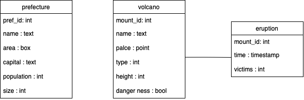

# Spatial/Temporal Database

I created sample prefecture and volcano database for spatial/temporal database.

# Entity
Prefecture: prefucture in Japan(県).
- pref_id: id
- name: name of the prefecture
- area: geological area of the prefecture
- capital: capital city
- population: population of the prefecture
- size: the gross area (km^2)

Volcano: vlocano in Japan.
- mount_id: id
- name: name of the volcano
- place: geological place of the volcano described by point
- type: type of the volcano(0: shield volcano, 1: strato volcano, 2: lava dome)
- height: height of the volcano(m)
- dangerness: activeness of the volcano.

# Releation
Relation of prefecture and volcano: this is not described as table, but you can know it by `volcano_belongs_to` function.

Eruption: Describes eruption event of each volcano.
- mount_id: id of volcano
- time: when the eruption happened
- victims: number of victims


# User Defined Functions
volcano_belongs_to: Describe which prefecture does given volcano id belongs to.
- input: volcano id
- output: prefecture id(s)

nearest_from: Return nearest volcano from given point.
- input: point
- output: nearest volcano id from given point

is_eruption_in_time_range: Check whether given volcano has erupted within given time range.
- input: voicano id, time1, time2
- output: if given volcano had erupted in [time1, time2], then return true, else false

# ER graph



# Program and sample data
At here I discribe both table definition and sample data by SQL program.

```sql
drop table if exists prefecture;
create table prefecture
(
    pref_id int,
    name text,
    area box,
    capital text,
    population int,
    size int
);

insert into prefecture(pref_id, name, area, capital, population, size) 
values (1, 'HOKKAIDO', box('(3,3)', '(4,4)'), 'SAPPORO', 5000000, 80000);
insert into prefecture(pref_id, name, area, capital, population, size) 
values (2, 'AOMORI', box('(2.5,2.5)', '(3,3)'), 'AOMORI', 100000, 3000);
insert into prefecture(pref_id, name, area, capital, population, size) 
values (3, 'NAGANO', box('(2,2)', '(2.5,2.5)'), 'MATSUMOTO', 300000, 6000);
insert into prefecture(pref_id, name, area, capital, population, size) 
values (4, 'YAMANASHI', box('(0.5,0.5)', '(1.2,1.2)'), 'KOFU', 300000, 4000);
insert into prefecture(pref_id, name, area, capital, population, size) 
values (5, 'TOKYO', box('(1,-1)', '(2,-3)'), 'TOKYO', 10000000, 3000);

insert into prefecture(pref_id, name, area, capital, population, size) 
values (6, 'HYOUGO', box('(-1,1)', '(-2,2)'), 'KOBE', 100000, 5000);
insert into prefecture(pref_id, name, area, capital, population, size) 
values (7, 'KUMAMOTO', box('(-1,-1)', '(-1.5,-1.5)'), 'KUMAMOTO', 90000, 5000);
insert into prefecture(pref_id, name, area, capital, population, size) 
values (8, 'KAGOSHIMA', box('(-2.9,-2.9)', '(-4,-4)'), 'KAGOSHIMA',41000, 5000);
insert into prefecture(pref_id, name, area, capital, population, size) 
values (9, 'NAGASAKI', box('(-2,-1)', '(-3,-2)'), 'NAGASAKI', 20000, 3000);
insert into prefecture(pref_id, name, area, capital, population, size) 
values (10, 'OKINAWA', box('(-5,-5)', '(-7,-7)'), 'NAHA', 10000, 300);


drop table if exists volcano;
create table volcano
(
    mount_id int,
    name text,
    place point,
    type int,
    height int,
    dangerness boolean
);

insert into volcano(mount_id, name, place, type, height, dangerness) 
values (1, 'ASAMA', '(2,2)', 0, 3000, 't');
insert into volcano(mount_id, name, place, type, height, dangerness) 
values (2, 'FUJI', '(1,1)' , 1, 1000, 'f');
insert into volcano(mount_id, name, place, type, height, dangerness) 
values (3, 'RISHIRI', '(3,3)', 2, 1500, 't');
insert into volcano(mount_id, name, place, type, height, dangerness) 
values (4, 'IZU_OSHIMA', '(1,-1)', 0, 2000, 'f');
insert into volcano(mount_id, name, place, type, height, dangerness) 
values (5, 'UNZEN', '(-2,-1)', 1, 2500, 't');
insert into volcano(mount_id, name, place, type, height, dangerness) 
values (6, 'ASO', '(-1,-1)', 2, 1000, 'f');
insert into volcano(mount_id, name, place, type, height, dangerness) 
values (7, 'SAKURA', '(-2,-2)', 0, '400', 't');

drop table if exists eruption;
create table eruption 
(
    mount_id int,
    time timestamptz,
    victims int
);
insert into eruption (mount_id, time, victims) values (1, '1960/1/1', 50000);
insert into eruption (mount_id, time, victims) values (1, '1840/1/1', 20000);
insert into eruption (mount_id, time, victims) values (2, '300/1/1', 1000);
insert into eruption (mount_id, time, victims) values (3, '600/1/1', 300);
insert into eruption (mount_id, time, victims) values (3, '1200/1/1', 2000);
insert into eruption (mount_id, time, victims) values (3, '1800/1/1', 100000);
insert into eruption (mount_id, time, victims) values (4, '1870/1/1', 5660);
insert into eruption (mount_id, time, victims) values (4, '1950/1/1', 3994);
insert into eruption (mount_id, time, victims) values (4, '1980/1/1', 2444);
insert into eruption (mount_id, time, victims) values (5, '400/1/1', 2111);
insert into eruption (mount_id, time, victims) values (5, '600/1/1', 5000);
insert into eruption (mount_id, time, victims) values (6, '1300/1/1', 5000);
insert into eruption (mount_id, time, victims) values (7, '2000/1/1', 2000);
insert into eruption (mount_id, time, victims) values (7, '1900/1/1', 1000);

create or replace function volcano_belongs_to(int)
returns int as
$body$
select sq.pref_id from (
    select prefecture.pref_id
    from prefecture, volcano
    where volcano.mount_id=$1 and prefecture.area @> volcano.place
) as sq;
$body$
language sql;

create or replace function nearest_from(point)
returns int as 
$body$
select sq.mount_id from (
    select mount_id, place <-> $1 as d 
    from volcano order by d asc limit 1
) as sq;
$body$
language sql;

create or replace function is_eruption_in_time_range(int, timestamptz, timestamptz)
returns boolean as
$body$
select sq is not null from (
    select * 
    from eruption 
    where mount_id=$1 and $2 <= time and time <= $3 
) as sq;
$body$
language sql;
```

# Sample program
```sql
select * from volcano_belongs_to(1);

 volcano_belongs_to 
--------------------
                  3
(1 row)
```

At here, by using `volcano_belongs_to`, you can check volcano `ASAMA` belongs to `NAGANO` prefecture.


```sql
select * from nearest_from('(0,0)');

 nearest_from 
--------------
            2
(1 row)

```

At here, by using `nearest_from`, you can check volcano `ASAMA` belongs to `NAGANO` prefecture.


```sql
select * 
from is_eruption_in_time_range(4, '1700/1/1', '2000/1/1');

 is_eruption_in_time_range 
---------------------------
 t
(1 row)
```

At here, by using `is_eruption_in_time_range` you can check that `IZU_OSHIMA` volcano had erupted within time range 1700/1/1~2000/1/1.

# Discussion
Spatial/temporal data enables finding hidden relation by calculation. This gives high expressiveness of database, and even caching for claculation result can be implemented easily.

Spatial/temporal data gives us 4 dimensional(3D in space + 1D in time) view, which will be able to exploited by visualization.